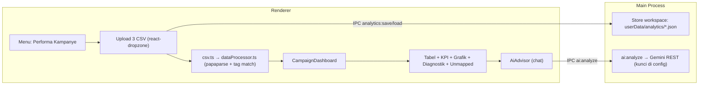

# Implementasi Fitur "Detail Performa Kampanye" — Acuan Pengerjaan

> Dokumen ini adalah **acuan pengerjaan** untuk fitur besar: analisis performa
> iklan Meta Ads vs komisi Shopee Affiliate (pencocokan tag otomatis + ROI +
> AI advisor), disatukan ke dalam RS OmniClip sebagai menu baru.
> Baca SELURUHNYA sebelum menulis kode. Update dokumen ini bila ada keputusan baru.
> Tanggal: 2026-08-16. Branch basis: `main` (v1.4.2). Fitur baru → branch `feat:` → PR.
>
> **STATUS (2026-08-16): Fase 0–7 SELESAI & DIVALIDASI** (get_errors bersih,
> eslint PASS, typecheck PASS, build PASS, E2E browser). Fase 8 (rilis) BELUM.
> Belum commit/push. Dikembangkan atas instruksi "silahkan kerjakan".
>
> Referensi logika & data: repo `dennsoe/rs-9` (clone acuan di
> `$TMPDIR/rs-9`, baseline `8e6c290`) — port `dataProcessor.ts`, `types.ts`,
> `demoData.ts`, dan pola komponen tabel/grafik/AI-nya, disesuaikan ke design system
> rs-omni.

---

## 0. Ringkasan & Keputusan Terkunci (2026-08-16)

| # | Keputusan | Nilai |
|---|---|---|
| 1 | Posisi fitur | **Menu sidebar baru `performa`** ("Performa Kampanye") di antara `downloader` & `about` — produk mandiri, bukan mode dalam Pengunduh. |
| 2 | Auth | **TANPA sistem login/users/roles** — fitur single-user lokal, konsisten dgn seluruh rs-omni. |
| 3 | Parsing CSV | **Renderer** (papaparse) untuk v1 — persis alur rs-9; dibungkus `csv.ts` agar mudah dipindah ke main process bila CSV sangat besar. |
| 4 | Penyimpanan workspace | **Main process store** `userData/analytics/<id>.json` (tulis atomik tmp+rename, pola sama `config.ts`). Multi-profil (per akun bisnis). |
| 5 | AI Advisor | **Via main process (IPC `ai:analyze`)** — kunci `GEMINI_API_KEY` disimpan di config main, TANPA SDK (`fetch` Node bawaan). **WAJIB lewat main** karena CSP renderer `connect-src 'self' ws:` memblokir fetch keluar. Bukan auth — hanya 1 kunci di Pengaturan. |
| 6 | Grafik | **`recharts`** (bar Spend vs Komisi, pie status pesanan) + tabel kinerja harian & breakdown per jam. |
| 7 | Persistensi preferensi | `usePersistentState` + `PREF_KEYS` (pola yang sudah ada) untuk config ringan (mapping rule, PPN, status terpilih). |
| 8 | Demo data | Bawaan (port `demoData.ts` rs-9) agar fitur langsung dicoba tanpa file asli. |
| 9 | Versioning | Rilis sebagai **v1.5.0** setelah selesai + validasi. |
| 10 | Desain | **100% mengikuti design system rs-omni** (Bagian 2) — bukan menyalin gaya rs-9 yang cyber/Matrix. |

---

## 1. Konvensi Proyek (WAJIB — pelanggaran = ditolak user)

- **PR workflow**: fitur di branch → push → PR → merge commit `gh pr merge N --merge` (BUKAN squash). Jangan push tanpa instruksi eksplisit.
- **Anti AI-slop / anti emoji**: SEMUA ikon dari `lucide-react`; teks UI Bahasa Indonesia; no emoji. Badge status pakai ikon (mis. `CheckCircle2` / `XCircle` / `CircleAlert`).
- **Tailwind v4 canonical**: `z-1` (bukan `z-[1]`), `bg-linear-to-r` (bukan `bg-gradient-to-r`), `shrink-0` (bukan `flex-shrink-0`), `h-4.5` (bukan `h-[18px]`). Hindari arbitrary `[]` bila ada utility bawaan.
- **Modal pattern**: TANPA `AnimatePresence` (motion 12 macet di StrictMode) — pakai `{open && <motion.div initial animate>}` (tanpa exit). Backdrop `fixed inset-0 z-70`, Escape menutup.
- **Tombol primer**: `inline-flex items-center gap-2 rounded-lg bg-blue-600 px-3.5 py-2 text-sm font-semibold text-white shadow-sm shadow-blue-500/20 transition-all hover:bg-blue-700 active:scale-95 disabled:cursor-not-allowed disabled:opacity-50` + icon `h-4 w-4`.
- **Dark mode**: `.dark` disinkronkan ke `<html>` di App.tsx. Semua komponen baru WAJIB punya `dark:`.
- **Tabel super-responsif** (pola standar aplikasi): container `flex-1 min-h-0 overflow-y-auto` + `<th class="sticky top-0 ...">`; **YANG SCROLL = BODY TABEL**, bukan halaman.
- **Audit forensik**: setelah SETIAP perubahan → `get_errors` + `npx eslint src/` + `npx tsc --noEmit` + `npm run build`. Update `docs/CURRENT_STATE.md`.

---

## 2. Design System (WAJIB konsisten dengan tema rs-omni)

### 2.1 Identitas visual
| Aspek | Aturan |
|---|---|
| Font | `Plus Jakarta Sans Variable` (bundel lokal, sudah aktif) — JANGAN ganti. |
| Primer | Biru `blue-600`/`blue-500`, gradasi `bg-linear-to-r from-blue-600 to-blue-500` untuk pill aktif & tombol aksi utama. |
| Status | Hijau `emerald` (Winning/sukses), merah `rose` (Boncos/gagal), kuning `amber` (BEP/peringatan), `slate` (netral). |
| Kartu/panel | `rounded-2xl border border-slate-200 bg-white dark:bg-slate-800/60 dark:border-slate-700` + `shadow-sm`; panel header `bg-slate-50/80 dark:bg-slate-900/40`. |
| Input | `FloatingInput`/`FloatingTextarea`/`FloatingSelect`/`FloatingMultiSelect` (gaya Google outlined, sudah ada di `components/ui/`). |
| Ikon header bagian | Lingkaran `h-7 w-7 rounded-lg bg-blue-50 text-blue-600 dark:bg-slate-900/60 dark:text-blue-400` + ikon `h-4 w-4` (pola `HistoryView`). |
| Sidebar item | Nav array di `App.tsx` (~baris 1028) + pill aktif `layoutId="nav-active-bg"`. Ikon menu: `BarChart3`. |

### 2.2 Badge ROI (adaptasi dari screenshot, gaya rs-omni)
- **Winning** (ROI ≥ 120%): `inline-flex items-center gap-1 rounded-full bg-emerald-50 text-emerald-700 border border-emerald-200 dark:bg-emerald-500/10 dark:text-emerald-400 dark:border-emerald-500/20` + ikon `CheckCircle2 h-3.5 w-3.5`.
- **BEP** (ROI ≥ 100% & < 120%): varian `amber`.
- **Boncos** (ROI < 100%): varian `rose` + ikon `XCircle`/`CircleAlert`.
- Tabel angka kanan = `font-mono tabular-nums`; judul = `text-[11px] uppercase tracking-wider text-slate-400`.

### 2.3 Peta warna ROI (angka yang sama dengan rs-9, tampilan rs-omni)
| Status | Ambang ROI | Warna |
|---|---|---|
| Winning | `>= 120%` | emerald |
| BEP | `100% <= ROI < 120%` | amber |
| Boncos | `< 100%` | rose |

---

## 3. Peta Arsitektur (file yang dibuat / disentuh)

### 3.1 File BARU (renderer)
```
src/lib/campaign/types.ts            # port types rs-9 + tipe workspace & profil
src/lib/campaign/dataProcessor.ts    # port dataProcessor.ts rs-9 (findKey, parse, match, daily/hourly)
src/lib/campaign/csv.ts              # wrapper parse (papaparse) + detect decimal separator
src/lib/campaign/demoData.ts         # port demo CSV rs-9
src/views/CampaignView.tsx           # halaman utama: wizard upload ⇄ dashboard
src/components/campaign/CampaignUploadWizard.tsx   # panduan kolom + upload 3 langkah + demo
src/components/campaign/CampaignDashboard.tsx     # container: KPI, filter, tab konten
src/components/campaign/CampaignMetrics.tsx       # kartu KPI + PPN dinamis + status filter
src/components/campaign/CampaignTable.tsx         # INTI: persis screenshot (search/sort/badge/expand)
src/components/campaign/DiagnosticsPanel.tsx      # validasi kolom + daftar tag (hijau/kuning)
src/components/campaign/UnmappedSection.tsx       # iklan tanpa tag + pesanan organik
src/components/campaign/CampaignCharts.tsx        # recharts: bar + pie + tabel harian per jam
src/components/campaign/CampaignDateRange.tsx     # filter rentang tanggal (pola rs-omni, kalender ringkas)
src/components/campaign/AiAdvisor.tsx             # FASE 7: chat Gemini via IPC (Markdown)
```

### 3.2 File DIUBAH
| File | Perubahan |
|---|---|
| `src/App.tsx` | Tipe `activeMenu` + `'performa'`; tambah item nav (ikon `BarChart3`); render `CampaignView`; state profil & workspace; ekspor/import workspace; tombol "Reset data kampanye". |
| `src/lib/preferences.ts` | `PREF_KEYS`/`PREF_DEFAULTS`: `campaignMappingRule`, `campaignTaxRate`, `campaignStatuses`, `campaignActiveProfile`, `campaignDateStart/End`, `campaignLastWorkspaceId`. |
| `src/types/global.d.ts` | Perluas `window.api` (channel baru Bagian 4). |
| `electron/preload/index.ts` | Expose `analytics:*` + `ai:analyze`. |
| `electron/main/config.ts` | Perluas `AppConfig` (`geminiApiKey?: string`, `campaignSettings`); tambah store workspace `userData/analytics/` (list/load/save/delete, tulis atomik). |
| `electron/main/index.ts` | Daftarkan handler IPC baru (pola fungsi tunggal yang sudah ada). |
| `docs/IPC_CONTRACT.md`, `docs/CURRENT_STATE.md` | Dokumentasi kontrak & status. |

### 3.3 Aliran data


---

## 4. Kontrak IPC Baru (ditambahkan, tidak mengubah kontrak inti)

| Arah | Channel | Tujuan |
|---|---|---|
| R → M | `analytics:list` (invoke) | Daftar workspace `{ id, name, updatedAt, profileName }` |
| R → M | `analytics:load` (invoke) | Muat workspace by id → `CampaignWorkspace` |
| R → M | `analytics:save` (invoke) | Simpan workspace `{ id?, name, profileName, metaCsvText, shopeeCsvText, shopeeClicksText, settings }` → `{ id, savedAt }` |
| R → M | `analytics:delete` (invoke) | Hapus workspace by id |
| R → M | `ai:analyze` (invoke) | `{ campaignsSummary, totalMetrics, question?, chatHistory? }` → `{ text }` (kunci Gemini dari config; `fetch` di main) |

> **Penting**: CSP renderer `connect-src 'self' ws:` → jangan tambah domain Gemini di CSP.
> AI HARUS lewat `ai:analyze` (main process).

---

## 5. Data Model (ringkas — detail di `src/lib/campaign/types.ts`)

- `MetaAdRow`, `ShopeeAffiliateRow` (termasuk `tag1–tag5`, `netAffiliateCommission`, `raw`), `ShopeeClickRow`
- `MappedCampaign` (tag, adNames, spend, clicks, shopeeClicksCount, ordersCount, commission, salesValue, roi, cpa, cpc, conversionRate, orderIds)
- `UnmappedAd`, `UnmappedOrder`
- `TotalMetrics` (totalSpend, totalCommission, netProfit, roi, totalClicks, totalShopeeClicks, totalImpressions, totalOrders, conversionRate, averageCpc, cpa, taxAmount, totalSpendWithTax, netProfitWithTax, roiWithTax)
- `DailyPerformanceRow` (+ `hourlyPerformance: HourlyPerformanceRow[]`)
- `CampaignSettings` (mappingRule, taxRate, selectedStatuses, dateStart/End)
- `CampaignWorkspace` (id, name, profileName, metaCsvText, shopeeCsvText, shopeeClicksText, settings, updatedAt)

**Logika inti (port dari rs-9, sudah matang):**
- `findKey()` fuzzy kolom + *protected terms* (hasil/biaya/klik/komisi dll.) agar tidak salah tangkap kolom.
- `detectDecimalSeparator()` — penting untuk format Indonesia (ribuan titik / desimal koma).
- Tag matching `contains`/`exact` → ROI/CPA/CPC/conversion + agregasi harian & per jam.
- Skip baris TOTAL/summary agar tidak dobel hitung.
- Filter status default mengecualikan Batal/Cancel/Refund (proteksi akurasi ROI).

---

## 6. Dependensi Baru

| Paket | Keperluan | Wajib |
|---|---|---|
| `papaparse` + `@types/papaparse` | Parsing CSV | Ya (Fase 0) |
| `recharts` | Grafik bar/pie | Ya (Fase 4) |
| Gemini SDK | TIDAK — pakai `fetch` bawaan Node di main | Tidak |

---

## 7. Peta Jalan Pengerjaan (Roadmap) — 9 Fase

Legenda: `[ ]` belum · `[x]` selesai. Setiap fase diakhiri **gerbang validasi**
(tsc/lint/build + E2E manual di aplikasi) lalu PR.

### Fase 0 — Fondasi Data & Dependensi (SELESAI)
- [x] Tambah deps: `papaparse`, `@types/papaparse`.
- [x] `src/lib/campaign/types.ts` — port + JSDoc Indonesia.
- [x] `src/lib/campaign/dataProcessor.ts` — port penuh dari rs-9 (parse Meta/Shopee/Klik, match, metrik, harian+per jam, filter tanggal).
- [x] `src/lib/campaign/csv.ts` — wrapper papaparse + detect decimal separator.
- [x] `src/lib/campaign/demoData.ts` — demo CSV.
- [x] Gerbang: `tsc --noEmit` PASS.

### Fase 1 — Menu & Halaman Utama (SELESAI)
- [x] Perluas tipe `activeMenu` + item nav `performa` (ikon `BarChart3`, label "Performa Kampanye", desc "Meta Ads vs Shopee Affiliate").
- [x] `CampaignView.tsx` — halaman wizard + dashboard (gaya rs-omni). Wizard panduan kolom + 3 langkah upload (Meta wajib, Shopee wajib, Klik opsional) + tombol "Coba Data Demo" + tombol reset.
- [x] Gerbang: navigasi menu jalan, wizard tampil, demo data memuat tanpa error.

### Fase 2 — Tabel Kampanye (INTI — persis screenshot) (SELESAI)
- [x] `CampaignTable.tsx` — kolom: TAG/NAMA IKLAN (sub-baris "Ad: ..." + ikon lingkaran kecil), SPEND (META), KLIK META, KLIK SHOPEE, ORDERS, KOMISI (SHOPEE), ROI/STATUS.
- [x] Search "Cari tag atau nama iklan..." + sort per kolom (panah asc/desc).
- [x] Badge Winning/BEP/Boncos — gaya rs-omni.
- [x] Row expand: detail profit, CPC, CPA, konversi, nilai penjualan + daftar ID pesanan.
- [x] Tabel super-responsif: body scroll internal + header sticky.
- [x] Gerbang: tabel + search + badge terverifikasi E2E.

### Fase 3 — KPI, Keuangan & Filter (SELESAI)
- [x] `CampaignMetrics.tsx` — kartu: Total Spend, Komisi Bersih, Net Profit/Loss, ROI; klik Meta vs Shopee; KPI sekunder.
- [x] **PPN dinamis** (default 12%) → Beban PPN, Total Spend+Pajak, Net Profit pasca pajak, ROI pasca pajak.
- [x] Filter status pesanan (chip, "Pilih Semua"/"Selesai Saja", peringatan bila kosong).
- [x] Mapping rule `contains`/`exact` + `CampaignDateRange` (7/30 hari, bulan ini, reset).
- [x] Gerbang: angka konsisten (demo: spend 143.533, komisi 107.580, ROI 75%).

### Fase 4 — Grafik & Performa Harian (SELESAI)
- [x] Tambah `recharts`.
- [x] `CampaignCharts.tsx` — bar chart Spend vs Komisi, pie status pesanan (total di tengah), tabel kinerja harian + breakdown per jam (expand per tanggal) + baris TOTAL.
- [x] Gerbang: grafik render, tooltip IDR, tema dark/light.

### Fase 5 — Diagnostik & Data Tidak Terpetakan (SELESAI)
- [x] `DiagnosticsPanel.tsx` — validasi kolom terdeteksi (Meta/Shopee), jumlah baris, tag hijau (cocok) / kuning (tidak cocok).
- [x] `UnmappedSection.tsx` — iklan tanpa tag + pesanan organik/tanpa iklan.
- [x] Gerbang: warning akurat utk data rusak/tak cocok.

### Fase 6 — Persistensi & Ekspor (SELESAI)
- [x] `electron/main/engine/campaign.ts` — store `userData/analytics/` (list/load/save/delete, tulis atomik).
- [x] Preload + `global.d.ts` + handler IPC (`analytics:*`).
- [x] Multi-profil: pilih profil di halaman; workspace per profil.
- [x] Export/Import workspace (`.json`) + **Export CSV hasil** (BOM UTF-8).
- [x] Persistensi CSV + pengaturan via `usePersistentState` (localStorage) — pulih saat dibuka lagi.
- [x] Gerbang: workspace save/load/delete via IPC; export/import di UI.

### Fase 7 — AI Advisor (opsional tapi direkomendasikan) (SELESAI)
- [x] `AppConfig.geminiApiKey` + field kunci di Pengaturan (config main, TANPA login).
- [x] `ai:analyze` di main (`fetch` Gemini REST, model `gemini-3.5-flash`, system prompt digital-marketing Indonesia — port rs-9).
- [x] `AiAdvisor.tsx` — chat (auto-audit, quick analysis chips, jawaban Markdown via `Markdown.tsx`, loading state, graceful tanpa kunci).
- [x] Gerbang: AI via main (tidak mengubah CSP); kunci tidak bocor ke renderer. (Perlu GEMINI_API_KEY nyata utk uji live.)

### Fase 8 — Audit, Dokumentasi & Rilis v1.5.0
- [ ] Audit forensik menyeluruh: `get_errors`, `eslint src/`, `tsc --noEmit`, `npm run build`.
- [ ] Update `docs/CURRENT_STATE.md`, `docs/IPC_CONTRACT.md`, `docs/IMPLEMENTATION_PERFORMA_KAMPANYE.md` (status fase), `release-notes/RELEASE_NOTES_v1.5.0.md`.
- [ ] Bump versi `1.4.2 → 1.5.0` di `package.json`.
- [ ] Branch `release/v1.5.0` → PR → merge commit `gh pr merge N --merge` → tag `v1.5.0` → GitHub Release + 4 artefak (mac dmg/zip + win setup/portable).
- [ ] Update `/memories/repo/` + `docs/CURRENT_STATE.md`.

---

## 8. Risiko & Mitigasi

| Risiko | Mitigasi |
|---|---|
| CSV besar lambat di renderer | Mulai renderer (v1); abstraksi `csv.ts` → mudah pindah ke main (parse via `fs` + papaparse, kirim hasil lewat IPC) |
| CSP blokir fetch AI | AI WAJIB via `ai:analyze` (main) — JANGAN ubah CSP `connect-src` |
| Motion 12 + StrictMode | Modal/overlay tanpa `AnimatePresence` (pola aplikasi) |
| Format angka Indonesia | `detectDecimalSeparator` + `Intl.NumberFormat("id-ID")` untuk Rp; `font-mono tabular-nums` |
| Status pesanan batal mengganggu ROI | Default filter mengecualikan Batal/Cancel/Refund |
| Salah interpretasi kolom generik | `findKey` + protected terms (port rs-9) |
| Konflik penyimpanan | Prefix kunci `omni.campaign.*` di `PREF_KEYS`; workspace di `userData/analytics/` (bukan localStorage) |

---

## 9. Daftar Periksa Desain (sebelum dianggap selesai)

- [ ] Semua ikon dari `lucide-react` (tidak ada emoji teks).
- [ ] `dark:` tersedia di setiap komponen baru; tema mengikuti toggle global.
- [ ] Font Plus Jakarta Sans; warna primer biru; status emerald/amber/rose.
- [ ] Tabel: header sticky, body scroll, halaman tidak scroll.
- [ ] Modal tanpa `AnimatePresence`; backdrop `z-70`; Escape menutup.
- [ ] Tombol primer mengikuti kelas standar (Bagian 1).
- [ ] Tidak ada string hardcode berbahasa selain Indonesia untuk label UI.
