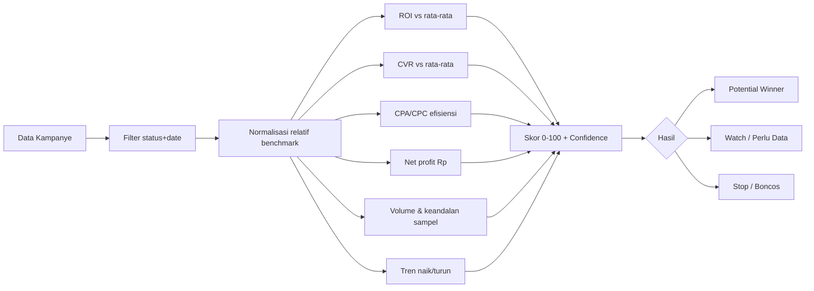

# Rencana — Deteksi Akurat "Winning Product" di Performa Kampanye

> **Status**: RENCANA / BRAINSTORMING (belum diimplementasi).
> Tanggal diskusi: 2026-08-16. Disimpan sementara; implementasi ditunda karena
> user mengerjakan hal lain dulu.
> Dokumen ini jadi acuan saat implementasi dimulai — baca ulang sebelum eksekusi.

## 1. Tujuan

User ingin pembaca (pengguna aplikasi) dapat **membaca secara akurat** iklan
mana yang berpotensi menjadi **winning product** di halaman Performa Kampanye
(analisis Meta Ads vs komisi Shopee Affiliate). Kata kunci: **"potensi"** —
bukan hanya yang sudah terbukti menang, tapi juga yang menunjukkan sinyal naik
walau volume masih kecil.

## 2. Kondisi Saat Ini (hasil audit kode)

### 2.1 Data per kampanye (`MappedCampaign` — `src/lib/campaign/types.ts`)

Tersedia per kampanye hasil pencocokan tag:
- `spend`, `clicks` (Meta `results`), `impressions`
- `ordersCount`, `commission` (netAffiliateCommission), `salesValue`
- `roi` (%) = `commission / spend * 100`
- `cpa`, `cpc`, `conversionRate` (orders/clicks %)
- `shopeeClicksCount` (klik link tag dari laporan klik Shopee)
- `orderIds`, `adNames`, `matchedTag`, `adSetName`

### 2.2 Pipeline akurasi yang SUDAH benar (jangan diubah)

- `mappedCampaigns` dihitung dari `processAndMatchData(filteredMetaAds,
  filteredShopeeOrders, mappingRule, filteredShopeeClicks)` (`CampaignView.tsx`)
  → ROI per kampanye **sudah memakai pesanan ter-filter status + tanggal**
  (bukan semua pesanan mentah). Status "Diproses/Tertunda/Selesai" yang tidak
  dipilih user tidak ikut dihitung.
- `statusBreakdown`, `totalMetrics`, `dailyPerformance` konsisten memakai data
  ter-filter.

### 2.3 Logika "winning" saat ini (TERLALU DANGKAL)

`CampaignTable.tsx` → `roiStatusOf(roi)`:
- `roi >= 120` → `winning`
- `roi >= 100` → `bep`
- selain itu → `boncos`

Hanya satu ambang ROI tanpa dasar statistik / benchmark / volume.

## 3. Gap yang Membuat Deteksi Belum Akurat

1. **Ambang ROI kaku (120/100)** — tidak relatif terhadap kampanye lain.
2. **Tanpa ukuran sampel** — 1 order ROI 80% dianggap bagus padahal noise.
3. **Tanpa tren waktu** — tidak tahu performa naik/turun (periode vs sebelumnya).
4. **Tanpa benchmark** — "menang" seharusnya relatif rata-rata semua/kategori.
5. **Hanya ROI %** — volume Rp kecil bisa tampak menang; `netProfit`, `cpa`,
   `cpc`, `conversionRate` sudah dihitung tapi tidak dipakai untuk menentukan
   winning.
6. **Tanpa konteks produk/kategori** — `categoryL1/L2/L3`, `shopType`
   (Shopee Mall), persen komisi per produk tersedia tapi belum dipakai.

## 4. Konsep: "Winning Score" Komposit

Alih-alih 1 ambang ROI, kampanye dinilai skor **potensi winning 0–100** dari
sinyal yang dinormalisasi relatif benchmark:

Kategori hasil:
- 🟢 **Potential Winner** — skor tinggi + sampel cukup (confidence tinggi).
- 🟡 **Watch / Perlu Data** — sinyal bagus tapi volume kecil ("potensi").
- 🔴 **Stop / Boncos** — skor rendah.

## 5. Pilihan Pendekatan (kombinasi yang direkomendasikan)

### A. Skor komposit (PALING DIREKOMENDASIKAN)
Gabungkan sinyal (ROI, CVR, CPA/CPC, net profit, volume, tren) dengan bobot
(konfigurabel). Hasil: ranking + skor + alasan singkat
("ROI 3x rata-rata, CVR naik, 45 pesanan → confidence tinggi").

### B. Syarat keandalan sampel
Wajib sebelum disebut winning: minimal pesanan (mis. ≥ 5–10), spend & klik
minimum, atau confidence statistik (Poisson/Bayesian untuk konversi).
Ini yang paling "akurat" secara statistik.

### C. Tren periode
Gunakan date range + fitur "Bandingkan" (sudah ada di date picker) untuk melihat
efisiensi naik/turun. CVR/ROI yang **membaik** = "potensi winning" walau total
kecil.

### D. Konteks produk
Segmentasi per kategori (`categoryL1/L2/L3`) / Shopee Mall; bandingkan dalam
kategori yang sama, bukan semua kampanye (margin produk beda).

## 6. Usulan UI/UX

- Kartu/ranking **"Potensi Winning Product"** di tab Ringkasan atau atas tab
  Kampanye: urutkan skor, tampilkan badge confidence.
- Setiap baris kampanye: tambah **skor + alasan singkat**, bukan hanya ROI.
- Klik kampanye → detail: breakdown confirmed/pending order, tren, perbandingan
  benchmark.
- Toggle "Tampilkan hanya yang keandalan tinggi" (saring noise).
- AI Advisor bisa otomatis menarasikan "kenapa produk ini berpotensi winning".

## 7. Pertanyaan Terbuka (belum dijawab user — tanyakan saat mulai implementasi)

1. Prioritas: **akurasi angka** (statistik/benchmark/sampel) atau **kemudahan
   baca** (ranking + skor + alasan)?
2. Definisi "winning": ROI % saja, profit Rupiah bersih, atau keduanya berbobot?
3. Batas volume minimum (usulan default: ≥ 5 pesanan & ≥ 500 klik)?
4. Tren: pakai "Bandingkan periode" yang sudah ada, atau indikator naik/turun
   sederhana?
5. Kategori: perlu segmentasi per kategori produk, atau cukup antar-semua
   kampanye dulu?

## 8. Rencana Implementasi (Fase — dimulai setelah user setuju & selesai hal lain)

- **Fase 1 — Fondasi skor**: helper analitik baru
  (`src/lib/campaign/winning.ts` mis.): benchmark rata-rata, normalisasi sinyal,
  skor komposit 0–100, klasifikasi (Potential Winner / Watch / Stop) + confidence.
  Unit-test ringan bila ada runner.
- **Fase 2 — Integrasi UI**: ranking "Potensi Winning Product" + badge skor di
  CampaignTable + detail per kampanye.
- **Fase 3 — Filter & konteks**: toggle keandalan tinggi; segmentasi kategori.
- **Fase 4 — AI narasi**: AiAdvisor memakai skor untuk menjelaskan "kenapa
  winning".
- Setiap fase: update `docs/CURRENT_STATE.md` + repo memory, typecheck/lint/build
  PASS, verifikasi CDP Electron.

## 9. Catatan

- Data demo (`demoData.ts`): kampanye SEKOLAH (ROI ~4,2%), TAS/SEPATU/MUKENA
  (0%), GAMIS (ROI ~80%) — contoh baik untuk menguji klasifikasi & confidence.
- Jangan mengubah pipeline pencocokan tag yang sudah akurat (Bagian 2.2).
